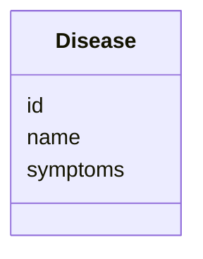

# Class: Disease 


_表示一種疾病實體_


URI: [https://w3id.org/my-github/disease-model/Disease](https://w3id.org/my-github/disease-model/Disease)





<!-- no inheritance hierarchy -->

## Slots

| Name | Cardinality and Range | Description | Inheritance |
| ---  | --- | --- | --- |
| [id](id.md) | 1 <br/> [String](String.md) | 疾病的唯一識別碼 (例如 MONDO ID) | direct |
| [name](name.md) | 1 <br/> [String](String.md) | 疾病名稱 | direct |
| [symptoms](symptoms.md) | * <br/> [String](String.md) | 該疾病對應的表型 ID (HPO ID) | direct |


## Identifier and Mapping Information


### Schema Source


* from schema: https://w3id.org/my-github/disease-model


## Mappings

| Mapping Type | Mapped Value |
| ---  | ---  |
| self | https://w3id.org/my-github/disease-model/Disease |
| native | https://w3id.org/my-github/disease-model/Disease |


## LinkML Source

<!-- TODO: investigate https://stackoverflow.com/questions/37606292/how-to-create-tabbed-code-blocks-in-mkdocs-or-sphinx -->

### Direct

<details>
```yaml
name: Disease
description: 表示一種疾病實體
from_schema: https://w3id.org/my-github/disease-model
attributes:
  id:
    name: id
    description: 疾病的唯一識別碼 (例如 MONDO ID)
    from_schema: https://w3id.org/my-github/disease-model
    rank: 1000
    identifier: true
    domain_of:
    - Disease
    required: true
  name:
    name: name
    description: 疾病名稱
    from_schema: https://w3id.org/my-github/disease-model
    rank: 1000
    domain_of:
    - Disease
    required: true
  symptoms:
    name: symptoms
    description: 該疾病對應的表型 ID (HPO ID)
    from_schema: https://w3id.org/my-github/disease-model
    rank: 1000
    domain_of:
    - Disease
    range: string
    multivalued: true

```
</details>

### Induced

<details>
```yaml
name: Disease
description: 表示一種疾病實體
from_schema: https://w3id.org/my-github/disease-model
attributes:
  id:
    name: id
    description: 疾病的唯一識別碼 (例如 MONDO ID)
    from_schema: https://w3id.org/my-github/disease-model
    rank: 1000
    identifier: true
    alias: id
    owner: Disease
    domain_of:
    - Disease
    range: string
  name:
    name: name
    description: 疾病名稱
    from_schema: https://w3id.org/my-github/disease-model
    rank: 1000
    alias: name
    owner: Disease
    domain_of:
    - Disease
    range: string
    required: true
  symptoms:
    name: symptoms
    description: 該疾病對應的表型 ID (HPO ID)
    from_schema: https://w3id.org/my-github/disease-model
    rank: 1000
    alias: symptoms
    owner: Disease
    domain_of:
    - Disease
    range: string
    multivalued: true

```
</details>